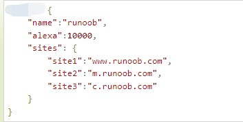
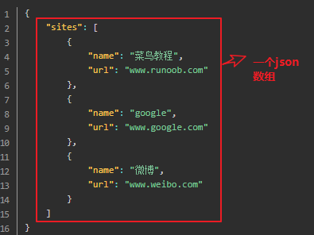
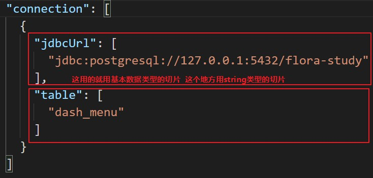
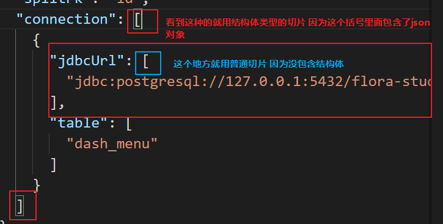

## json
### 1.JSON名称/值对
```json
"key" : value
"name":"狗子"
"age" : 20
```
### 2.JSON 的value
可以是：
数字（整数或浮点数）
字符串（在双引号中）
逻辑值（true 或 false）
大括号 {} 保存对象
中括号 [] 保存数组，数组可以包含多个对象
### 3.JSON对象
#### 1.JSON 对象在大括号中书写：
对象可以包含多个名称/值对：
```json
{
    "key1" : value1,
    "key2" : value2,
      ... 
    "keyN" : valueN 
}
```
#### 2.JSON对象嵌套

### 4.JSON数组
JSON 数组在中括号中书写：
数组可包含多个对象：


### 5.JSON转结构体
一个JSON对象对应一个结构体
#### 1.遇到json数组
以下面的JSON数组为例：

定义一个结构体 再定义一个结构体 然后嵌套为切片  解析结构体要从下往上 从内向外
```go
type Sites struct{
    webset webset[]
}
type Webset struct{
    Name string
    Url string
}
```
个别的还有
```json
"sites":[
    {
        "name":"狗子1号",
        "age":18
    },
    {
        "name":"狗子2号",
        "age":18
    },
    {
        "price":88,
        "num":10
    },
    {
        "price":100,
        "num":100
    },
]
```
```go

type Market struct{
    Price float64
    Nun int
}
type People struct{
    Name string
    Age string
}
type Sites struct{
    People People[]
    Market Market[]
}

```
还是那个思路只不过再加一个结构体类型的切片

个别还还有
```json
"sites":[
    {
        "name":"狗子1号",
        "age":18
    },
    {
        "price":88,
        "num":10
    }
]
```

```go

type Market struct{
    Price float64
    Nun int
}
type People struct{
    Name string
    Age string
}
type Sites struct{
    People People
    Market Market
}
```

#### 2.遇到JSON对象嵌套
直接嵌套结构体即可
### 3.其他情况


#### 注
