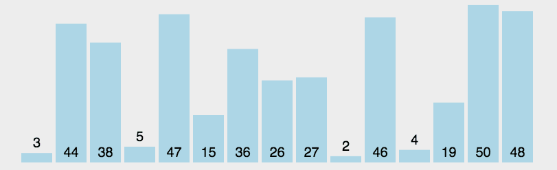

# 1.冒泡排序
冒泡排序（Bubble Sort） 最为简单的一种排序，通过重复走完数组的所有元素，通过打擂台的方式两个两个比较，直到没有数可以交换的时候结束这个数，再到下个数，直到整个数组排好顺序。因一个个浮出所以叫冒泡排序。双重循环时间 O(n^2)


## 算法描述：
比较相邻两个数据如果。第一个比第二个大，就交换两个数
对每一个相邻的数做同样1的工作，这样从开始一队到结尾一队在最后的数就是最大的数。
针对所有元素上面的操作，除了最后一个。
重复1~3步骤，知道顺序完成。

## 代码可视化：


## 代码实现：
```go
//冒泡排序
	var numSlice = []int{9, 6, 5, 3, 8}
	for i := 0; i < len(numSlice); i++ {
		for j := 0; j < len(numSlice)-1-i; j++ {
			if numSlice[j] > numSlice[j+1] {
				temp := numSlice[j]
				numSlice[j] = numSlice[j+1]
				numSlice[j+1] = temp
			}
		}
	}
	fmt.Println(numSlice)
```
# 2.选择排序
选择排序（Select Sort） 是直观的排序，通过确定一个 Key 最大或最小值，再从带排序的的数中找出最大或最小的交换到对应位置。再选择次之。双重循环时间复杂度为 O(n^2)

## 算法描述：
在一个长度为 N 的无序数组中，第一次遍历 n-1 个数找到最小的和第一个数交换。
第二次从下一个数开始遍历 n-2 个数，找到最小的数和第二个数交换。
重复以上操作直到第 n-1 次遍历最小的数和第 n-1 个数交换，排序完成。

## 算法可视化：

## 代码实现：
```go
//选择排序
var numSlice = [...]int{9, 8, 7, 6, 5, 4}
			for i := 0; i < len(numSlice); i++ {
				for j := i + 1; j < len(numSlice); j++ {
					if numSlice[i] > numSlice[j] {
						temp := numSlice[i]
						numSlice[i] = numSlice[j]
						numSlice[j] = temp
					}
				}
			}
			fmt.Println(numSlice)
```